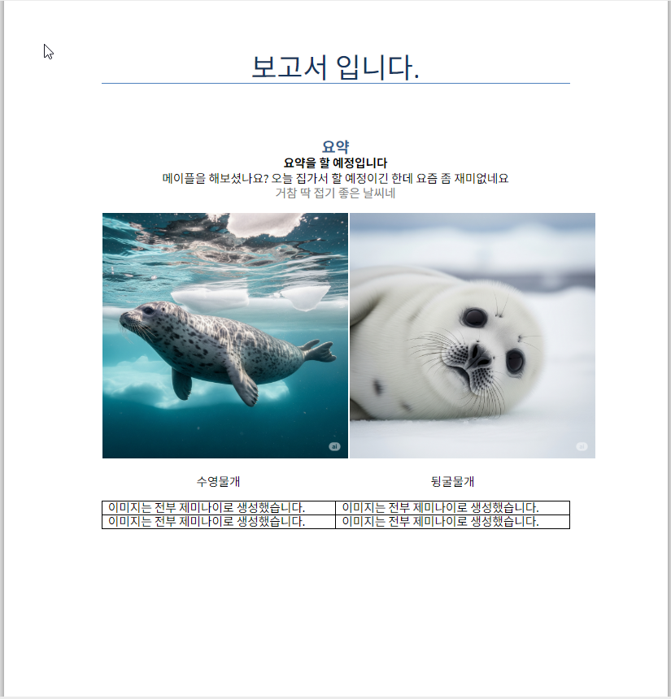
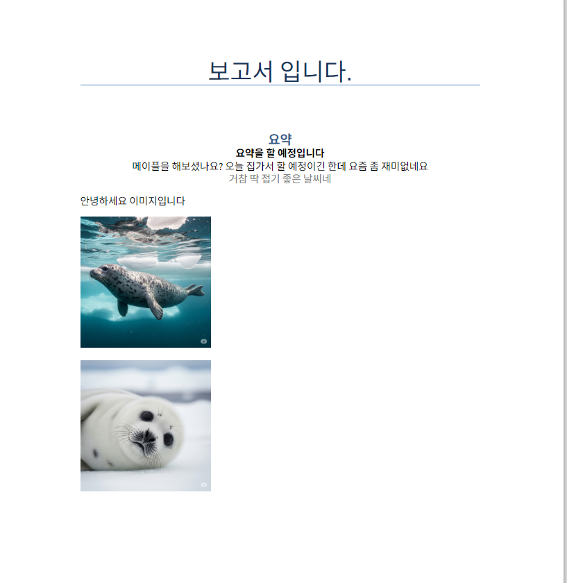
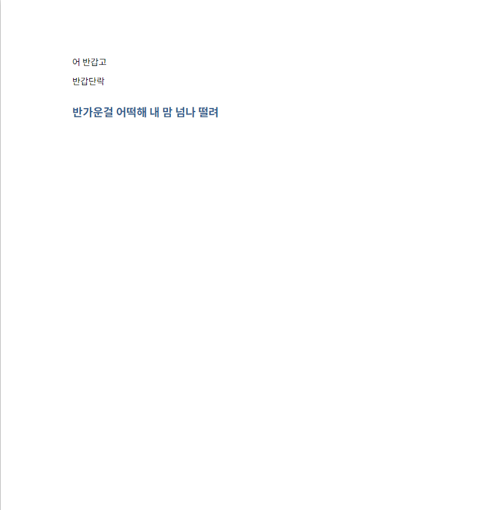

# 워드 보고서 템플릿

## 개요

이 템플릿은 Python의 `python-docx` 라이브러리를 사용하여 다양한 유형의 워드 보고서를 자동 생성하는 예시 코드를 제공합니다.

## 파일 구조

```
make_report/
├── template/
│   ├── README.md               # 이 파일
│   └── code/
│       └── report.py           # 보고서 생성 코드
└── image/                      # 예시 이미지들
    ├── Cursor_6MnMx69wWR.png
    ├── Cursor_3yPrL9z45P.png
    ├── Cursor_azrBa7z9ZQ.png
    └── Cursor_cEi6qlPj9A.png
```

## 보고서 유형

### 1. 기본 튜토리얼 보고서 - 이미지, 표 , 본문 및 제목

**코드 파일**: `code/tutorial_report.py`



### 2. 데이터 분석 보고서

matplotlib 차트를 포함한 데이터 분석 보고서

**코드 파일**: `code/data_analysis_report.py`



### 3. 프로젝트 진행 보고서

테이블을 포함한 프로젝트 상황 보고서

**코드 파일**: `code/project_progress_report.py`


### 4. 실험 결과 보고서

상관관계 분석 결과를 포함한 실험 보고서

**코드 파일**: `code/experiment_result_report.py`



## 필요한 라이브러리

```bash
pip install python-docx matplotlib seaborn pandas
```

## 기본 사용법

1. `code/` 폴더에서 원하는 보고서 유형의 Python 파일 확인
2. 필요에 따라 내용 및 이미지 경로 수정
3. 코드 실행하여 워드 문서 생성
