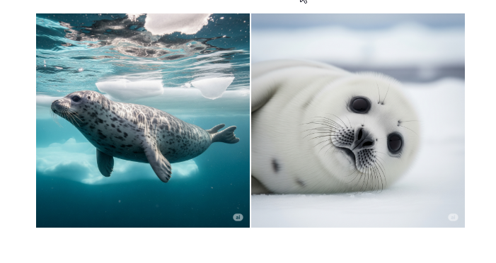

# 코드별 워드 저장 예시

## 개요

이 문서는 다양한 코드 유형에 따라 워드가 어떻게 저장되고 관리되는지 보여주는 예시입니다.

## 1. 튜토리얼 보고서 워드 코드

### 코드 예시

```python
from docx import Document
from docx.enum.text import WD_ALIGN_PARAGRAPH
from docx.shared import Pt, Cm
# 한국 사람이니까 폰트 크기 및 센치미터를 불러와서 사이즈를 적용하겠습니다. 인치도 있으니 필요시에 사용하세용  
from docx.shared import RGBColor
# 색깔을 위해 사용합니다. 

documnet = Document()
# 객체 선언 

title = documnet.add_heading('보고서 입니다.', level = 0)

title.alignment =WD_ALIGN_PARAGRAPH.CENTER
# 중앙 정렬을 지정합니다. 매개변수로 right , left도 있습니다 

documnet.add_paragraph()
# 이렇게 하면 빈줄을 추가합니다. 
sunmmer=documnet.add_heading('요약',level=1)
sunmmer.alignment = WD_ALIGN_PARAGRAPH.CENTER
# 중앙정렬
chorock = documnet.add_paragraph()
# 줄을 잡아두고 
chorock.add_run('요약을 할 예정입니다\n').bold = True 
chorock.add_run('메이플을 해보셨나요? 오늘 집가서 할 예정이긴 한데 요즘 좀 재미없네요\n').font.size = Pt(11)
chorock.add_run('거참 딱 접기 좋은 날씨네').font.color.rgb = RGBColor(128, 128, 128)
chorock.alignment = WD_ALIGN_PARAGRAPH.CENTER
# 2개 넣을 거니까 1행 2열이면 되겠죠? 
image_table = documnet.add_table(rows=1,cols=2)
left_cell = image_table.cell(0,0)
left_cell_section = left_cell.paragraphs[0]
left_cell_section.alignment = WD_ALIGN_PARAGRAPH.CENTER
left_cell_section.add_run().add_picture(r'image\mul.png',width = Cm(8))

right_cell = image_table.cell(0,1)
right_cell_section = right_cell.paragraphs[0]
right_cell_section.alignment = WD_ALIGN_PARAGRAPH.CENTER
right_cell_section.add_run().add_picture(r'image\mul2.png',width = Cm(8))
text_table = documnet.add_table(cols=2,rows=1)

ltext_cell = text_table.cell(0,0)
ltext_cell_section = ltext_cell.paragraphs[0]
ltext_cell_section.alignment = WD_ALIGN_PARAGRAPH.CENTER
# 위치 같아야 그 위치 밑에 텍스트가 박힙니다. 
ltext_cell_section.add_run('수영물개')

rtext_cell = text_table.cell(0,1)
rtext_cell_section = rtext_cell.paragraphs[0]
rtext_cell_section.alignment = WD_ALIGN_PARAGRAPH.CENTER
rtext_cell_section.add_run('뒹굴물개')
tables=documnet.add_table(2,2)
tables.style = 'Table Grid'

for row in tables.rows:
    for cell in row.cells:
        cell.text = '이미지는 전부 제미나이로 생성했습니다.'

documnet.save(save)
```

### 저장된 워드파일 예시


**저장 경로**: 지정하시면 됩니다.

---

## 2. 데이터 분석 보고서 워드 코드

### 코드 예시

```python
from docx import Document
from docx.enum.text import WD_ALIGN_PARAGRAPH
from docx.shared import Pt, Cm, Inches
from docx.shared import RGBColor
import matplotlib.pyplot as plt
import io

# 문서 생성
doc = Document()

# 제목 추가
title = doc.add_heading('데이터 분석 보고서', level=0)
title.alignment = WD_ALIGN_PARAGRAPH.CENTER

# 요약 섹션
summary_heading = doc.add_heading('분석 요약', level=1)
summary_para = doc.add_paragraph()
summary_para.add_run('이번 분석에서는 ').font.size = Pt(12)
summary_para.add_run('머신러닝 모델의 성능을 평가').bold = True
summary_para.add_run('하였습니다.').font.size = Pt(12)

# 차트 추가 (메모리에서 직접)
fig, ax = plt.subplots(figsize=(8, 6))
ax.plot([1, 2, 3, 4], [10, 20, 25, 30], 'o-')
ax.set_title('성능 향상 추이')
ax.set_xlabel('실험 횟수')
ax.set_ylabel('정확도 (%)')

# 이미지를 메모리에 저장
img_buffer = io.BytesIO()
fig.savefig(img_buffer, format='png', dpi=300, bbox_inches='tight')
img_buffer.seek(0)

# 워드에 이미지 삽입
chart_para = doc.add_paragraph()
chart_para.alignment = WD_ALIGN_PARAGRAPH.CENTER
chart_para.add_run().add_picture(img_buffer, width=Cm(12))

# 결론 섹션
conclusion = doc.add_heading('결론', level=1)
doc.add_paragraph('분석 결과 지속적인 성능 향상을 확인할 수 있었습니다.')

doc.save('data_analysis_report.docx')
```

### 저장된 워드파일 예시


**저장 경로**: 지정하시면 됩니다.

---

## 3. 프로젝트 진행 보고서 워드 코드

### 코드 예시

```python
from docx import Document
from docx.enum.text import WD_ALIGN_PARAGRAPH
from docx.shared import Pt, Cm
from docx.shared import RGBColor
from docx.oxml.shared import OxmlElement, qn

# 문서 생성
doc = Document()

# 제목 및 날짜
title = doc.add_heading('프로젝트 진행 현황 보고서', level=0)
title.alignment = WD_ALIGN_PARAGRAPH.CENTER

date_para = doc.add_paragraph()
date_para.alignment = WD_ALIGN_PARAGRAPH.RIGHT
date_para.add_run('작성일: 2024년 12월 15일').font.size = Pt(10)

# 진행 상황 테이블
doc.add_heading('진행 현황', level=1)
progress_table = doc.add_table(rows=1, cols=4)
progress_table.style = 'Table Grid'

# 테이블 헤더
hdr_cells = progress_table.rows[0].cells
hdr_cells[0].text = '작업 항목'
hdr_cells[1].text = '담당자'
hdr_cells[2].text = '진행률'
hdr_cells[3].text = '완료 예정일'

# 데이터 행 추가
tasks = [
    ['데이터 수집', '김개발', '100%', '2024-12-10'],
    ['모델 개발', '이분석', '80%', '2024-12-20'],
    ['테스트', '박검증', '30%', '2024-12-25']
]

for task in tasks:
    row_cells = progress_table.add_row().cells
    for i, cell_text in enumerate(task):
        row_cells[i].text = cell_text

# 이슈 및 해결방안
doc.add_heading('주요 이슈 및 해결방안', level=1)
issue_para = doc.add_paragraph()
issue_para.add_run('1. 데이터 품질 문제: ').bold = True
issue_para.add_run('전처리 로직 개선으로 해결\n')
issue_para.add_run('2. 성능 최적화: ').bold = True
issue_para.add_run('알고리즘 튜닝 진행 중')

doc.save('project_progress_report.docx')
```

### 저장된 워드파일 예시



**저장 경로**: 지정하시면 됩니다.

---

## 4. 실험 결과 보고서 워드 코드

### 코드 예시

```python
from docx import Document
from docx.enum.text import WD_ALIGN_PARAGRAPH
from docx.shared import Pt, Cm
from docx.shared import RGBColor
import matplotlib.pyplot as plt
import seaborn as sns
import pandas as pd
import io

# 문서 생성
doc = Document()

# 제목
title = doc.add_heading('실험 결과 분석 보고서', level=0)
title.alignment = WD_ALIGN_PARAGRAPH.CENTER

# 실험 개요
doc.add_heading('실험 개요', level=1)
overview = doc.add_paragraph()
overview.add_run('목적: ').bold = True
overview.add_run('데이터 간 상관관계 분석\n')
overview.add_run('방법: ').bold = True
overview.add_run('피어슨 상관계수 계산 및 히트맵 시각화\n')
overview.add_run('기간: ').bold = True
overview.add_run('2024년 12월 1일 ~ 15일')

# 결과 차트 삽입 (샘플 데이터)
data = pd.DataFrame({
    'A': [1, 2, 3, 4, 5],
    'B': [2, 4, 6, 8, 10],
    'C': [5, 4, 3, 2, 1]
})

# 히트맵 생성
fig, ax = plt.subplots(figsize=(8, 6))
sns.heatmap(data.corr(), annot=True, cmap='coolwarm', center=0, ax=ax)
ax.set_title('변수 간 상관관계 히트맵')

# 메모리에 저장
img_buffer = io.BytesIO()
fig.savefig(img_buffer, format='png', dpi=300, bbox_inches='tight')
img_buffer.seek(0)

# 워드에 삽입
doc.add_heading('분석 결과', level=1)
result_para = doc.add_paragraph()
result_para.alignment = WD_ALIGN_PARAGRAPH.CENTER
result_para.add_run().add_picture(img_buffer, width=Cm(12))

# 결론
doc.add_heading('결론', level=1)
conclusion = doc.add_paragraph()
conclusion.add_run('주요 발견사항:\n').bold = True
conclusion.add_run('• 변수 A와 B는 강한 양의 상관관계 (r=1.0)\n')
conclusion.add_run('• 변수 A와 C는 강한 음의 상관관계 (r=-1.0)\n')
conclusion.add_run('• 추후 모델링 시 다중공선성 주의 필요')

doc.save('experiment_result_report.docx')
```

### 저장된 워드파일 예시


**저장 경로**: 지정하시면 됩니다.

---

## 워드 문서 저장 디렉토리 구조

```
project/
├── reports/
│   ├── tutorial/              # 튜토리얼 보고서
│   │   ├── basic_reports/
│   │   └── advanced_reports/
│   ├── data_analysis/         # 데이터 분석 보고서
│   │   ├── monthly_reports/
│   │   ├── project_reports/
│   │   └── ad_hoc_analysis/
│   ├── project_management/    # 프로젝트 관리 보고서
│   │   ├── progress_reports/
│   │   ├── status_updates/
│   │   └── milestone_reports/
│   ├── experiments/           # 실험 결과 보고서
│   │   ├── research_reports/
│   │   ├── test_results/
│   │   └── validation_reports/
│   └── templates/            # 워드 템플릿 파일
│       ├── report_templates/
│       └── style_guides/
```

## 워드 문서 생성 시 주요 기능

| 기능 유형        | 사용 라이브러리/메서드           | 설명                                    |
| ---------------- | -------------------------------- | --------------------------------------- |
| 문서 생성        | `Document()`                     | 새로운 워드 문서 객체 생성              |
| 제목 추가        | `add_heading(text, level)`       | 제목 및 소제목 추가 (level 0~9)         |
| 단락 추가        | `add_paragraph(text)`            | 일반 텍스트 단락 추가                   |
| 테이블 생성      | `add_table(rows, cols)`          | 표 생성 및 데이터 삽입                  |
| 이미지 삽입      | `add_picture(image_path, width)` | 이미지 파일 또는 메모리 이미지 삽입     |
| 텍스트 서식      | `.bold`, `.font.size`, `.color`  | 글씨 굵기, 크기, 색상 등 서식 설정      |
| 정렬             | `WD_ALIGN_PARAGRAPH.CENTER`      | 텍스트 정렬 (CENTER, LEFT, RIGHT)       |
| 문서 저장        | `save(filename)`                 | 워드 문서 파일로 저장                   |

## 워드 문서 서식 설정

```python
from docx.shared import Pt, Cm, RGBColor
from docx.enum.text import WD_ALIGN_PARAGRAPH

# 텍스트 서식 설정
paragraph = doc.add_paragraph()
run = paragraph.add_run('텍스트 내용')
run.font.size = Pt(12)                    # 글씨 크기
run.font.name = '맑은 고딕'               # 폰트 설정
run.bold = True                           # 굵게
run.italic = True                         # 기울임
run.font.color.rgb = RGBColor(255, 0, 0)  # 글자 색상 (빨간색)

# 단락 정렬
paragraph.alignment = WD_ALIGN_PARAGRAPH.CENTER  # 중앙 정렬

# 이미지 크기 설정
image_run = paragraph.add_run()
image_run.add_picture('image.png', width=Cm(10))  # 폭 10cm로 설정
```

## 워드 문서 자동화 스크립트 예시

```python
import os
from datetime import datetime
from docx import Document
from docx.enum.text import WD_ALIGN_PARAGRAPH
from docx.shared import Pt, Cm

def create_report_template(report_type, title, save_dir='./reports'):
    """
    보고서 템플릿을 자동으로 생성하는 함수
    """
    # 디렉토리 생성
    os.makedirs(save_dir, exist_ok=True)
    
    # 문서 생성
    doc = Document()
    
    # 제목 설정
    title_paragraph = doc.add_heading(title, level=0)
    title_paragraph.alignment = WD_ALIGN_PARAGRAPH.CENTER
    
    # 날짜 추가
    date_para = doc.add_paragraph()
    date_para.alignment = WD_ALIGN_PARAGRAPH.RIGHT
    current_date = datetime.now().strftime('%Y년 %m월 %d일')
    date_para.add_run(f'작성일: {current_date}').font.size = Pt(10)
    
    # 기본 섹션 추가
    doc.add_heading('개요', level=1)
    doc.add_paragraph('이곳에 보고서 개요를 작성하세요.')
    
    doc.add_heading('내용', level=1)
    doc.add_paragraph('이곳에 주요 내용을 작성하세요.')
    
    doc.add_heading('결론', level=1)
    doc.add_paragraph('이곳에 결론을 작성하세요.')
    
    # 파일명 생성 및 저장
    timestamp = datetime.now().strftime('%Y%m%d_%H%M%S')
    filename = f"{report_type}_report_{timestamp}.docx"
    filepath = os.path.join(save_dir, filename)
    doc.save(filepath)
    
    print(f"보고서 템플릿 생성됨: {filepath}")
    return filepath
```

## 사용 예시

```python
# 데이터 분석 보고서 생성
create_report_template('data_analysis', '월간 데이터 분석 보고서', './reports/monthly')

# 프로젝트 진행 보고서 생성
create_report_template('project_progress', 'AI 모델 개발 진행 현황', './reports/projects')

# 실험 결과 보고서 생성
create_report_template('experiment', '성능 최적화 실험 결과', './reports/experiments')
```
